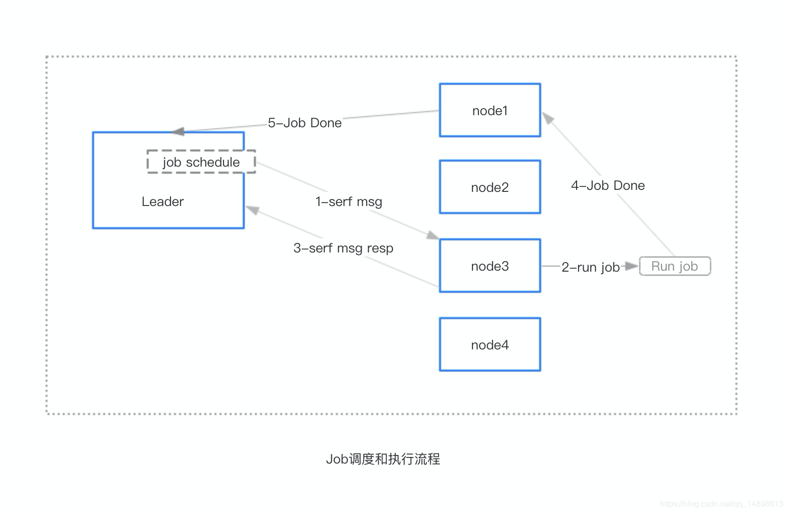

- [dkron](#dkron)
    - [基础架构](#基础架构)
        - [Dkron特点](#dkron特点)
        - [Dkron-v2整体架构图](#dkron-v2整体架构图)
        - [job执行流程图](#job执行流程图)
# dkron
## 基础架构
Dkron分布式定时任务系统 [Github](https://github.com/distribworks/dkron)

Dkron是一个分布式，启动迅速，容错的定时任务系统，支持cron表达式。

### Dkron特点

易用：易操作和漂亮的UI

可靠：支持容错

高可扩展性：能够处理大量的计划作业和数千个节点

Dkron是用Go编写的，它利用Raft协议和Serf的强大功能提供容错性、可靠性和可扩展性，同时保持简单易安装。

### Dkron-v2整体架构图

Dkron每个节点都是由一个web服务、grpc服务、raft服务、serf服务、badger数据库构成。

web负责转发来自前端job的元信息给grpc服务，一般的grpc操作都在leader节点进行。job的调度和修改保存都要通过leader，只有获取job的信息不需要到leader节点，因为每个节点的数据是一致的。有人会说这样的话那是不是leader的压力会不会太大，不必担心，由于对于job的增删改其实请求是很小的，而且job的执行也不是在leader，所以大可不必担心。

Serf用于服务发现和节点故障提醒，提供节点成员信息，执行job任务。

嵌入式数据库badger负责在每个节点存储数据，通过Raft协议保证数据一致性。

Dkron的每个节点在运行的服务上都是相同的，但存在一个仲裁节点leader，job的增删改都需要直接通过它来进行，但查询job不需要通过leader在本机即可查询。job更新后leader的调度器job schedule会重启一次，调度器只会在leader节点运行。

当集群中当前的leader失去leader地位时，它会关闭job schedule，而获得leader地位的节点会启动job schedule，这就保证了任务只会执行一次。

当leader的调度器检查到将有任务需要执行时，它会发一个serf的消息，serf会随机发送给任意一个节点去执行，当执行完成后会通知leader的执行结果，并写进数据库。

### job执行流程图

在leader节点处，当job schedule的任务触发时，leader发送一个serf消息（1-serf msg），serf会随机选择一个节点发送。当收到serf发送的执行job的消息后，节点会启动一个协程去运行job（2-run job），接着返回给serf收到运行消息并正在执行任务的响应（3-serf msg resp）。

当Run job结束后会根据hash一致性随机选择一个节点发送grpc消息，将执行结果发送出去（4-Job Done），这里为什么不直接发给leader呢？是因为有可能当时存在leader未选举出来。因此随机选择一个节点，再将请求转发到leader，保证执行结果一定能发到leader（5-Job Done）。

最后leader会通过raft把数据复制到各个节点，最终一个任务就执行结束了。
