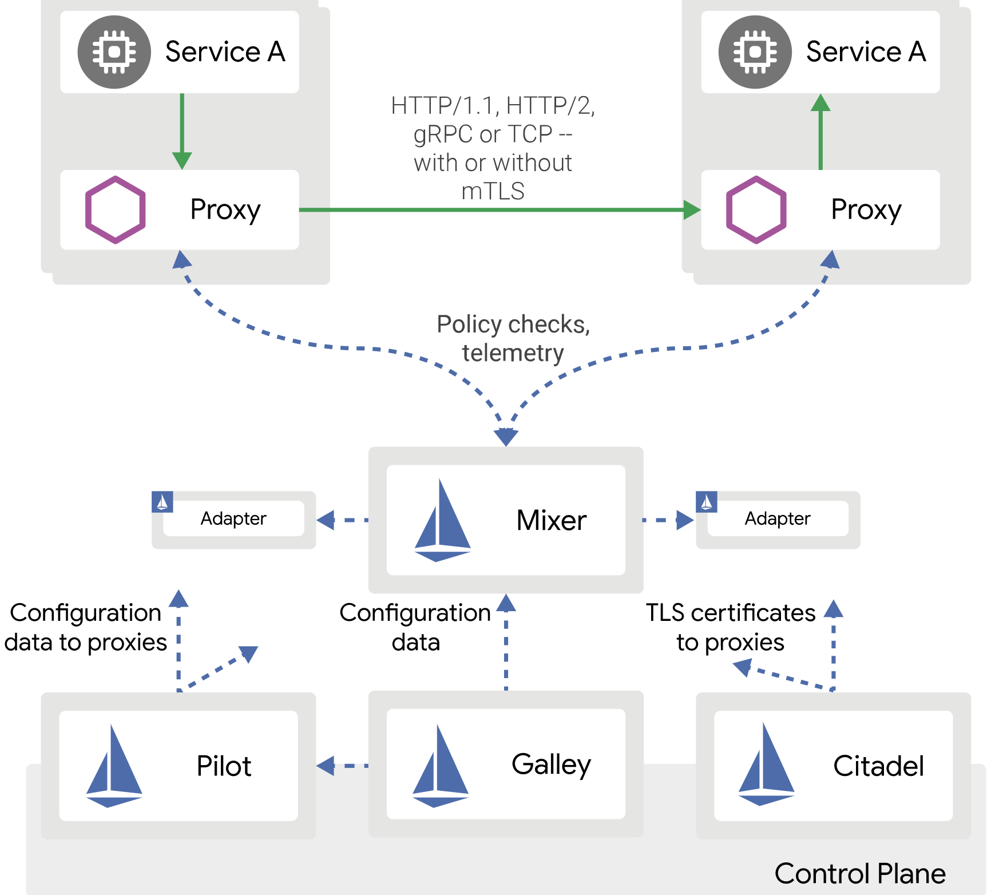
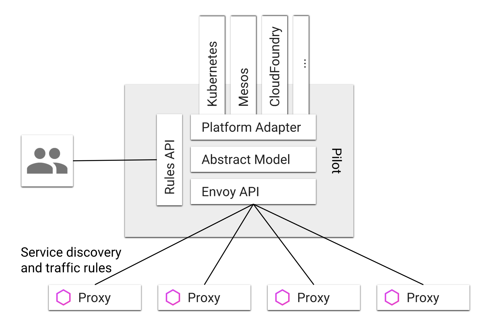
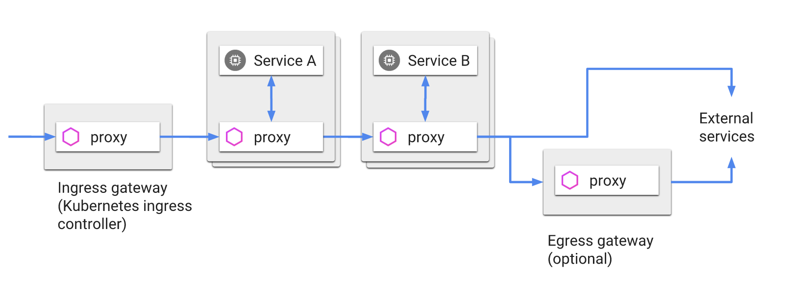
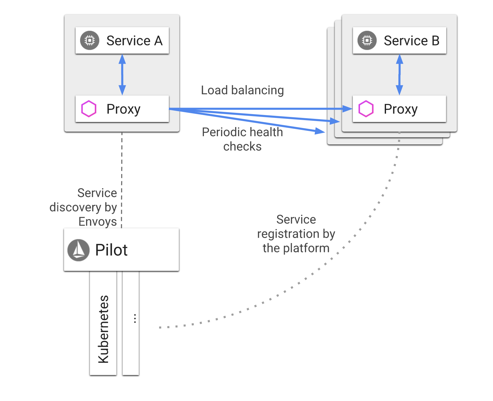

- [Istio](#istio)
    - [一、Istio是什么](#一、istio是什么)
        - [什么是服务网格](#什么是服务网格)
        - [为什么要使用Istio](#为什么要使用istio)
        - [特点](#特点)
        - [核心功能](#核心功能)
            - [流量管理](#流量管理)
            - [安全](#安全)
            - [可观察性](#可观察性)
            - [平台支持](#平台支持)
            - [集成和定制](#集成和定制)
        - [架构](#架构)
            - [Envoy](#envoy)
            - [Mixer](#mixer)
            - [Pilot](#pilot)
            - [Citadel](#citadel)
            - [Galley](#galley)
        - [设计目标](#设计目标)
    - [二、流量管理](#二、流量管理)
        - [Pilot和Envoy](#pilot和envoy)
        - [请求路由](#请求路由)
            - [服务之间的通信](#服务之间的通信)
            - [Ingress 和 Egress](#ingress-和-egress)
        - [服务发现和负载均衡](#服务发现和负载均衡)
        - [故障处理](#故障处理)
            - [微调](#微调)
        - [故障注入](#故障注入)
        - [规则配置](#规则配置)
        - [Virtual Service](#virtual-service)
            - [规则的目标描述](#规则的目标描述)
            - [在服务之间分拆流量](#在服务之间分拆流量)
            - [超时和重试](#超时和重试)
# Istio

## 一、Istio是什么

> Istio：一个连接，管理和保护微服务的开放平台。

### 什么是服务网格

> 服务网格（Service Mesh）这个术语通常用于描述构成这些应用程序的微服务网络以及应用之间的交互。随着规模和复杂性的增长，服务网格越来越难以理解和管理。它的需求包括`服务发现`、`负载均衡`、`故障恢复`、`指标收集`和`监控`以及通常更加复杂的运维需求，例如 A/B 测试、金丝雀发布、限流、访问控制和端到端认证等。

> 服务网格是用于处理服务间通信的专用基础设施层。它负责通过包含现代云原生应用程序的复杂服务拓扑来可靠地传递请求。实际上，服务网格通常通过一组轻量级网络代理来实现，这些代理与应用程序代码一起部署，而不需要感知应用程序本身。—— Willian Morgan Buoyant CEO

### 为什么要使用Istio

Istio 提供一种简单的方式来为已部署的服务建立网络，该网络具有负载均衡、服务间认证、监控等功能，只需要对服务的代码进行一点或不需要做任何改动。想要让服务支持 Istio，只需要在您的环境中部署一个特殊的 sidecar 代理，使用 Istio 控制平面功能配置和管理代理，拦截微服务之间的所有网络通信：

* HTTP、gRPC、WebSocket 和 TCP 流量的自动负载均衡。
* 通过丰富的路由规则、重试、故障转移和故障注入，可以对流量行为进行细粒度控制。
* 可插入的策略层和配置 API，支持访问控制、速率限制和配额。
* 对出入集群入口和出口中所有流量的自动度量指标、日志记录和追踪。
* 通过强大的基于身份的验证和授权，在集群中实现安全的服务间通信。

### 特点

* 应用程序间通讯的中间层
* 轻量级网络代理
* 应用程序无感知
* 解耦应用程序的重试/超时、监控、追踪和服务发现

### 核心功能

#### 流量管理

通过简单的规则配置和流量路由，控制服务之间的流量和 API 调用。简化了断路器、超时和重试等服务级别属性的配置，并且可以轻松设置 A/B测试、金丝雀部署和基于百分比的流量分割的分阶段部署等重要任务。

#### 安全

提供底层安全通信信道，并大规模管理服务通信的认证、授权和加密。

#### 可观察性

Istio 强大的追踪、监控和日志记录可让您深入了解服务网格部署。

Istio 的 Mixer 组件负责策略控制和遥测收集。它提供后端抽象和中介，将 Istio 的其余部分与各个基础架构后端的实现细节隔离开来，并为运维提供对网格和基础架构后端之间所有交互的细粒度控制。

所有这些功能可以让您可以更有效地设置、监控和实施服务上的 SLO。

#### 平台支持

Istio 目前支持：

* 在 Kubernetes 上部署的服务

* 使用 Consul 注册的服务

* 在虚拟机上部署的服务

#### 集成和定制

策略执行组件可以扩展和定制，以便与现有的 ACL、日志、监控、配额、审计等方案集成。

### 架构

Istio 服务网格逻辑上分为数据平面和控制平面。

* 数据平面由一组以 sidecar 方式部署的智能代理（Envoy）组成。这些代理可以调节和控制微服务及 Mixer 之间所有的网络通信。

* 控制平面负责管理和配置代理来路由流量。此外控制平面配置 Mixer 以实施策略和收集遥测数据。



#### Envoy

Istio 使用 Envoy 代理的扩展版本，Envoy 是以 C++ 开发的高性能代理，用于调解服务网格中所有服务的所有入站和出站流量。Envoy 的许多内置功能被 Istio 发扬光大，例如：

* 动态服务发现
* 负载均衡
* TLS 终止
* HTTP/2 & gRPC 代理
* 熔断器
* 健康检查、基于百分比流量拆分的灰度发布
* 故障注入
* 丰富的度量指标
Envoy 被部署为 sidecar，和对应服务在同一个 Kubernetes pod 中。这允许 Istio 将大量关于流量行为的信号作为属性提取出来，而这些属性又可以在 Mixer 中用于执行策略决策，并发送给监控系统，以提供整个网格行为的信息。

Sidecar 代理模型还可以将 Istio 的功能添加到现有部署中，而无需重新构建或重写代码。可以阅读更多来了解为什么我们在设计目标中选择这种方式。

#### Mixer

Mixer 是一个独立于平台的组件，负责在服务网格上执行访问控制和使用策略，并从 Envoy 代理和其他服务收集遥测数据。代理提取请求级属性，发送到 Mixer 进行评估。有关属性提取和策略评估的更多信息，请参见 Mixer 配置。

Mixer 中包括一个灵活的插件模型，使其能够接入到各种主机环境和基础设施后端，从这些细节中抽象出 Envoy 代理和 Istio 管理的服务。

#### Pilot

Pilot 为 Envoy sidecar 提供服务发现功能，为智能路由（例如 A/B 测试、金丝雀部署等）和弹性（超时、重试、熔断器等）提供流量管理功能。它将控制流量行为的高级路由规则转换为特定于 Envoy 的配置，并在运行时将它们传播到 sidecar。

Pilot 将平台特定的服务发现机制抽象化并将其合成为符合 Envoy 数据平面 API 的任何 sidecar 都可以使用的标准格式。这种松散耦合使得 Istio 能够在多种环境下运行（例如，Kubernetes、Consul、Nomad），同时保持用于流量管理的相同操作界面。

#### Citadel

Citadel 通过内置身份和凭证管理赋能强大的服务间和最终用户身份验证。可用于升级服务网格中未加密的流量，并为运维人员提供基于服务标识而不是网络控制的强制执行策略的能力。从 0.5 版本开始，Istio 支持基于角色的访问控制，以控制谁可以访问您的服务，而不是基于不稳定的三层或四层网络标识。

#### Galley

Galley 代表其他的 Istio 控制平面组件，用来验证用户编写的 Istio API 配置。随着时间的推移，Galley 将接管 Istio 获取配置、 处理和分配组件的顶级责任。它将负责将其他的 Istio 组件与从底层平台（例如 Kubernetes）获取用户配置的细节中隔离开来。

### 设计目标

Istio 的架构设计中有几个关键目标，这些目标对于使系统能够应对大规模流量和高性能地服务处理至关重要。

* **最大化透明度**：若想 Istio 被采纳，应该让运维和开发人员只需付出很少的代价就可以从中受益。为此，Istio 将自身自动注入到服务间所有的网络路径中。Istio 使用 sidecar 代理来捕获流量，并且在尽可能的地方自动编程网络层，以路由流量通过这些代理，而无需对已部署的应用程序代码进行任何改动。在 Kubernetes中，代理被注入到 pod 中，通过编写 iptables 规则来捕获流量。注入 sidecar 代理到 pod 中并且修改路由规则后，Istio 就能够调解所有流量。这个原则也适用于性能。当将 Istio 应用于部署时，运维人员可以发现，为提供这些功能而增加的资源开销是很小的。所有组件和 API 在设计时都必须考虑性能和规模。

* **可扩展性**：随着运维人员和开发人员越来越依赖 Istio 提供的功能，系统必然和他们的需求一起成长。虽然我们期望继续自己添加新功能，但是我们预计最大的需求是扩展策略系统，集成其他策略和控制来源，并将网格行为信号传播到其他系统进行分析。策略运行时支持标准扩展机制以便插入到其他服务中。此外，它允许扩展词汇表，以允许基于网格生成的新信号来执行策略。

* **可移植性**：使用 Istio 的生态系统将在很多维度上有差异。Istio 必须能够以最少的代价运行在任何云或预置环境中。将基于 Istio 的服务移植到新环境应该是轻而易举的，而使用 Istio 将一个服务同时部署到多个环境中也是可行的（例如，在多个云上进行冗余部署）。

* **策略一致性**：在服务间的 API 调用中，策略的应用使得可以对网格间行为进行全面的控制，但对于无需在 API 级别表达的资源来说，对资源应用策略也同样重要。例如，将配额应用到 ML 训练任务消耗的 CPU 数量上，比将配额应用到启动这个工作的调用上更为有用。因此，策略系统作为独特的服务来维护，具有自己的 API，而不是将其放到代理/sidecar 中，这容许服务根据需要直接与其集成。

## 二、流量管理

使用 Istio 的流量管理模型，本质上是**将流量与基础设施扩容解耦**，让运维人员可以通过 Pilot 指定流量遵循什么规则，而不是指定哪些 pod/VM 应该接收流量——Pilot 和智能 Envoy 代理会帮我们搞定。因此，例如，您可以通过 Pilot 指定特定服务的 5％ 流量可以转到金丝雀版本，而不必考虑金丝雀部署的大小，或根据请求的内容将流量发送到特定版本。


将流量从基础设施扩展中解耦，这样就可以**让 Istio 提供各种独立于应用程序代码之外的流量管理功能**。 除了 A/B 测试的动态请求路由，逐步推出和金丝雀发布之外， 它还使用超时、重试和熔断器来处理故障恢复， 最后还可以通过故障注入来测试服务之间故障恢复策略的兼容性。 这些功能都是通过在服务网格中部署的 Envoy sidecar/代理来实现的。

### Pilot和Envoy

Istio 流量管理的核心组件是 `Pilot`，它**管理和配置部署在特定 Istio 服务网格中的所有 `Envoy` 代理实例**。它允许您**指定在 Envoy 代理之间使用什么样的路由流量规则，并配置故障恢复功能，如超时、重试和熔断器**。它还**维护了网格中所有服务的规范模型**，并使用这个模型通过发现服务让 Envoy 了解网格中的其他实例。

每个 `Envoy` 实例都会**维护负载均衡信息信息**，这些信息来自 `Pilot` 以及对负载均衡池中其他实例的定期健康检查。从而允许其在目标实例之间智能分配流量，同时遵循其指定的路由规则。

`Pilot` 负责管理通过 Istio 服务网格发布的 `Envoy` 实例的生命周期。



如上图所示，在网格中 `Pilot` 维护了一个服务的规则表示并独立于底层平台。`Pilot`中的特定于平台的适配器负责适当地填充这个规范模型。例如，在 `Pilot` 中的 `Kubernetes` 适配器实现了必要的控制器，来观察 Kubernetes API 服务器，用于更改 pod 的注册信息、入口资源以及存储流量管理规则的第三方资源。这些数据被转换为规范表示。然后根据规范表示生成特定的 `Envoy` 的配置。

`Pilot` 公开了用于服务发现 、负载均衡池和路由表的动态更新的 API。

运维人员可以通过 `Pilot` 的 Rules API 指定高级流量管理规则。这些规则被翻译成低级配置，并通过 discovery API 分发到 `Envoy` 实例。

### 请求路由

网格中服务的规范表示由 Pilot 维护。服务的 Istio 模型和在底层平台（Kubernetes、Mesos 以及 Cloud Foundry 等）中的表达无关。特定平台的适配器负责从各自平台中获取元数据的各种字段，然后对服务模型进行填充。

Istio 引入了服务版本的概念，可以通过版本（v1、v2）或环境（staging、prod）对服务进行进一步的细分。这些版本不一定是不同的 API 版本：它们可能是部署在不同环境（prod、staging 或者 dev 等）中的同一服务的不同迭代。使用这种方式的常见场景包括 A/B 测试或金丝雀部署。Istio 的流量路由规则可以根据服务版本来对服务之间流量进行附加控制。

#### 服务之间的通信


如上图所示，服务的客户端不知道服务不同版本间的差异。它们可以使用服务的主机名或者 IP 地址继续访问服务。Envoy sidecar/代理拦截并转发客户端和服务器之间的所有请求和响应。

运维人员使用 Pilot 指定路由规则，Envoy 根据这些规则动态地确定其服务版本的实际选择。该模型使应用程序代码能够将它从其依赖服务的演进中解耦出来，同时提供其他好处（参见 Mixer）。路由规则让 Envoy 能够根据诸如 header、与源/目的地相关联的标签和/或分配给每个版本的权重等标准来进行版本选择。

Istio 还为同一服务版本的多个实例提供流量负载均衡。可以在服务发现和负载均衡中找到更多信息。

Istio 不提供 DNS。应用程序可以尝试使用底层平台（kube-dns、mesos-dns 等）中存在的 DNS 服务来解析 FQDN。

#### Ingress 和 Egress

Istio 假定进入和离开服务网络的所有流量都会通过 Envoy 代理进行传输。通过将 Envoy 代理部署在服务之前，运维人员可以针对面向用户的服务进行 A/B 测试、部署金丝雀服务等。类似地，通过使用 Envoy 将流量路由到外部 Web 服务（例如，访问 Maps API 或视频服务 API）的方式，运维人员可以为这些服务添加超时控制、重试、断路器等功能，同时还能从服务连接中获取各种细节指标。



### 服务发现和负载均衡

Istio 假定进入和离开服务网络的所有流量都会通过 Envoy 代理进行传输。通过将 Envoy 代理部署在服务之前，运维人员可以针对面向用户的服务进行 A/B 测试、部署金丝雀服务等。类似地，通过使用 Envoy 将流量路由到外部 Web 服务（例如，访问 Maps API 或视频服务 API）的方式，运维人员可以为这些服务添加超时控制、重试、断路器等功能，同时还能从服务连接中获取各种细节指标。



如上图所示，网格中的服务使用其 DNS 名称访问彼此。服务的所有 HTTP 流量都会通过 Envoy 自动重新路由。Envoy 在负载均衡池中的实例之间分发流量。虽然 Envoy 支持多种复杂的负载均衡算法，但 Istio 目前仅允许三种负载均衡模式：轮询、随机和带权重的最少请求。

除了负载均衡外，Envoy 还会定期检查池中每个实例的运行状况。Envoy 遵循熔断器风格模式，根据健康检查 API 调用的失败率将实例分类为不健康和健康两种。换句话说，当给定实例的健康检查失败次数超过预定阈值时，将会被从负载均衡池中弹出。类似地，当通过的健康检查数超过预定阈值时，该实例将被添加回负载均衡池。您可以在处理故障中了解更多有关 Envoy 的故障处理功能。

服务可以通过使用 HTTP 503 响应健康检查来主动减轻负担。在这种情况下，服务实例将立即从调用者的负载均衡池中删除。

### 故障处理

Envoy 提供了一套开箱即用，可选的的故障恢复功能，对应用中的服务大有裨益。这些功能包括：

1. 超时

2. 具备超时预算，并能够在重试之间进行可变抖动（间隔）的有限重试功能

3. 并发连接数和上游服务请求数限制

4. 对负载均衡池中的每个成员主动（定期）运行健康检查

5. 细粒度熔断器（被动健康检查）——适用于负载均衡池中的每个实例

这些功能可以使用 Istio 的流量管理规则在运行时进行动态配置。

对超载的上游服务来说，重试之间的抖动极大的降低了重试造成的影响，而超时预算确保调用方服务在可预测的时间范围内获得响应（成功/失败）。

主动和被动健康检查（上述 4 和 5 ）的组合最大限度地减少了在负载均衡池中访问不健康实例的机会。当将其与平台级健康检查（例如由 Kubernetes 或 Mesos 支持的检查）相结合时， 可以确保应用程序将不健康的 Pod/容器/虚拟机快速地从服务网格中去除，从而最小化请求失败和延迟产生影响。

总之，这些功能使得服务网格能够耐受故障节点，并防止本地故障导致的其他节点的稳定性下降。

#### 微调

Istio 的流量管理规则允许运维人员为每个服务/版本设置故障恢复的全局默认值。然而，服务的消费者也可以通过特殊的 HTTP 头提供的请求级别值覆盖超时和重试的默认值。在 Envoy 代理的实现中，对应的 Header 分别是 x-envoy-upstream-rq-timeout-ms 和 x-envoy-max-retries。

### 故障注入

虽然 Envoy sidecar/proxy 为在 Istio 上运行的服务提供了大量的故障恢复机制，但测试整个应用程序端到端的故障恢复能力依然是必须的。错误配置的故障恢复策略（例如，跨服务调用的不兼容/限制性超时）可能导致应用程序中的关键服务持续不可用，从而破坏用户体验。

Istio 能在不杀死 Pod 的情况下，将特定协议的故障注入到网络中，在 TCP 层制造数据包的延迟或损坏。我们的理由是，无论网络级别的故障如何，应用层观察到的故障都是一样的，并且可以在应用层注入更有意义的故障（例如，HTTP 错误代码），以检验和改善应用的弹性。

运维人员可以为符合特定条件的请求配置故障，还可以进一步限制遭受故障的请求的百分比。可以注入两种类型的故障：延迟和中断。延迟是计时故障，模拟网络延迟上升或上游服务超载的情况。中断是模拟上游服务的崩溃故障。中断通常以 HTTP 错误代码或 TCP 连接失败的形式表现。

### 规则配置

Istio 提供了一个简单的配置模型，用来控制 API 调用以及应用部署内多个服务之间的四层通信。运维人员可以使用这个模型来配置服务级别的属性，这些属性可以是断路器、超时、重试，以及一些普通的持续发布任务，例如金丝雀发布、A/B 测试、使用百分比对流量进行控制，从而完成应用的逐步发布等。

Istio 中包含有四种流量管理配置资源，分别是 VirtualService、DestinationRule、ServiceEntry 以及 Gateway。下面会讲一下这几个资源的一些重点。在网络参考中可以获得更多这方面的信息。

* VirtualService 在 Istio 服务网格中定义路由规则，控制路由如何路由到服务上。

* DestinationRule 是 VirtualService 路由生效后，配置应用与请求的策略集。

* ServiceEntry 是通常用于在 Istio 服务网格之外启用对服务的请求。

* Gateway 为 HTTP/TCP 流量配置负载均衡器，最常见的是在网格的边缘的操作，以启用应用程序的入口流量。

例如，将 reviews 服务接收到的流量 100% 地发送到 v1 版本，这一需求可以用下面的规则来实现：

```yaml
apiVersion: networking.istio.io/v1alpha3
kind: VirtualService
metadata:
  name: reviews
spec:
  hosts:
  - reviews
  http:
  - route:
    - destination:
        host: reviews
        subset: v1
```

这个配置的用意是，发送到 `reviews` 服务（在 `hosts` 字段中标识）的流量应该被路由到 `reviews` 服务实例的 v1 子集中。路由中的 `subset` 制定了一个预定义的子集名称，子集的定义来自于目标规则配置：

子集指定了一个或多个特定版本的实例标签。例如，在 Kubernetes 中部署 Istio 时，“version: v1” 表示只有包含 “version: v1” 标签版本的 pod 才会接收流量。

在 `DestinationRule` 中，你可以添加其他策略，例如：下面的定义指定使用随机负载均衡模式：

```yaml
apiVersion: networking.istio.io/v1alpha3
kind: DestinationRule
metadata:
  name: reviews
spec:
  host: reviews
  trafficPolicy:
    loadBalancer:
      simple: RANDOM
  subsets:
  - name: v1
    labels:
      version: v1
  - name: v2
    labels:
      version: v2
```

### Virtual Service

`VirtualService` 定义了控制在 Istio 服务网格中如何路由服务请求的规则。例如一个 Virtual Service 可以把请求路由到不同版本，甚至是可以路由到一个完全不同于请求要求的服务上去。路由可以用很多条件进行判断，例如请求的源和目的地、HTTP 路径和 Header 以及各个服务版本的权重等。

#### 规则的目标描述

路由规则对应着一或多个用 `VirtualService` 配置指定的请求目的主机。这些主机可以是也可以不是实际的目标负载，甚至可以不是同一网格内可路由的服务。例如要给到 `reviews` 服务的请求定义路由规则，可以使用内部的名称 `reviews`，也可以用域名 `bookinfo.com`，`VirtualService` 可以定义这样的 `hosts` 字段：

```yaml
hosts:
  - reviews
  - bookinfo.com
```

`hosts` 字段用显示或者隐式的方式定义了一或多个完全限定名（FQDN）。上面的 `reviews`，会隐式的扩展成为特定的 FQDN，例如在 Kubernetes 环境中，全名会从 `VirtualService` 所在的集群和命名空间中继承而来（比如说 `reviews.default.svc.cluster.local`）。

#### 在服务之间分拆流量

每个路由规则都需要对一或多个有权重的后端进行甄别并调用合适的后端。每个后端都对应一个特定版本的目标服务，服务的版本是依靠标签来区分的。如果一个服务版本包含多个注册实例，那么会根据为该服务定义的负载均衡策略进行路由，缺省策略是 `round-robin`。

例如下面的规则会把 25% 的 `reviews` 服务流量分配给 v2 标签；其余的 75% 流量分配给 v1：

```yaml
apiVersion: networking.istio.io/v1alpha3
kind: VirtualService
metadata:
  name: reviews
spec:
  hosts:
    - reviews
  http:
  - route:
    - destination:
        host: reviews
        subset: v1
      weight: 75
    - destination:
        host: reviews
        subset: v2
      weight: 25
```

#### 超时和重试

缺省情况下，HTTP 请求的超时设置为 15 秒，可以使用路由规则来覆盖这个限制：

```yaml
apiVersion: networking.istio.io/v1alpha3
kind: VirtualService
metadata:
  name: ratings
spec:
  hosts:
    - ratings
  http:
  - route:
    - destination:
        host: ratings
        subset: v1
    timeout: 10s
```

还可以用路由规则来指定某些 http 请求的重试次数。下面的代码可以用来设置最大重试次数，或者在规定时间内一直重试，时间长度同样可以进行覆盖：

```yaml
apiVersion: networking.istio.io/v1alpha3
kind: VirtualService
metadata:
  name: ratings
spec:
  hosts:
    - ratings
  http:
  - route:
    - destination:
        host: ratings
        subset: v1
    retries:
      attempts: 3
      perTryTimeout: 2s
```

注意请求的重试和超时还可以针对每个请求分别设置。

请求超时任务中展示了超时控制的相关示例。
