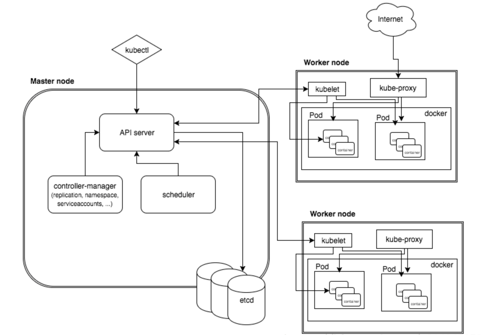

- [Kubernetes](#kubernetes)
    - [架构](#架构)
        - [介绍](#介绍)
        - [整体架构](#整体架构)
        - [Master Node（主节点）](#master-node主节点)
            - [API Server（API服务器）](#api-serverapi服务器)
            - [Cluster state store（集群状态存储）](#cluster-state-store集群状态存储)
            - [Controller-Manager Server（控制管理服务器）](#controller-manager-server控制管理服务器)
            - [Scheduler（调度器）](#scheduler调度器)
        - [Worker Node（从节点）](#worker-node从节点)
            - [Kubelet](#kubelet)
            - [Container Runtime（容器运行时）](#container-runtime容器运行时)
            - [kube proxy](#kube-proxy)
            - [kubectl](#kubectl)
        - [附加项和其他依赖](#附加项和其他依赖)
            - [网络和网络策略](#网络和网络策略)
            - [服务发现](#服务发现)
            - [可视化&控制](#可视化控制)
# Kubernetes

## 架构
### 介绍
自动化装箱：在不牺牲可用性的条件下，基于容器对资源的要求和约束自动部署容器。同时，为了提高利用率和节省更多资源，将关键和最佳工作量结合在一起。

自愈能力：当容器失败时，会对容器进行重启；当所部署的Node节点有问题时，会对容器进行重新部署和重新调度；当容器未通过监控检查时，会关闭此容器；直到容器正常运行时，才会对外提供服务。

水平扩容：通过简单的命令、用户界面或基于CPU的使用情况，能够对应用进行扩容和缩容。

服务发现和负载均衡：开发者不需要使用额外的服务发现机制，就能够基于Kubernetes进行服务发现和负载均衡。

自动发布和回滚：Kubernetes能够程序化的发布应用和相关的配置。如果发布有问题，Kubernetes将能够回归发生的变更。

保密和配置管理：在不需要重新构建镜像的情况下，可以部署和更新保密和应用配置。

存储编排：自动挂接存储系统，这些存储系统可以来自于本地、公共云提供商（例如：GCP和AWS）、网络存储(例如：NFS、iSCSI、Gluster、Ceph、Cinder和Floker等)

### 整体架构


Kubernetes属于主从分布式架构，主要由Master Node和Worker Node组成，以及包括客户端命令行工具kubectl和其它附加项。Master Node：作为控制节点，对集群进行调度管理；Master Node由API Server、Scheduler、Cluster State Store和Controller-Manger Server所组成；

Worker Node：作为真正的工作节点，运行业务应用的容器；Worker Node包含kubelet、kube proxy和Container Runtime；kubectl：用于通过命令行与API Server进行交互，而对Kubernetes进行操作，实现在集群中进行各种资源的增删改查等操作；

Add-on：是对Kubernetes核心功能的扩展，例如增加网络和网络策略等能力。

### Master Node（主节点）
#### API Server（API服务器）
API Server主要用来处理REST的操作，确保它们生效，并执行相关业务逻辑，以及更新etcd（或者其他存储）中的相关对象。API Server是所有REST命令的入口，它的相关结果状态将被保存在etcd（或其他存储）中。API Server的基本功能包括：

REST语义，监控，持久化和一致性保证，API 版本控制，放弃和生效
内置准入控制语义，同步准入控制钩子，以及异步资源初始化
API注册和发现
另外，API Server也作为集群的网关。默认情况，客户端通过API Server对集群进行访问，客户端需要通过认证，并使用API Server作为访问Node和Pod（以及service）的堡垒和代理/通道。

#### Cluster state store（集群状态存储）
Kubernetes默认使用etcd作为集群整体存储，当然也可以使用其它的技术。etcd是一个简单的、分布式的、一致的key-value存储，主要被用来共享配置和服务发现。etcd提供了一个CRUD操作的REST API，以及提供了作为注册的接口，以监控指定的Node。集群的所有状态都存储在etcd实例中，并具有监控的能力，因此当etcd中的信息发生变化时，就能够快速的通知集群中相关的组件。


#### Controller-Manager Server（控制管理服务器）
Controller-Manager Serve用于执行大部分的集群层次的功能，它既执行生命周期功能(例如：命名空间创建和生命周期、事件垃圾收集、已终止垃圾收集、级联删除垃圾收集、node垃圾收集)，也执行API业务逻辑（例如：pod的弹性扩容）。控制管理提供自愈能力、扩容、应用生命周期管理、服务发现、路由、服务绑定和提供。Kubernetes默认提供Replication Controller、Node Controller、Namespace Controller、Service Controller、Endpoints Controller、Persistent Controller、DaemonSet Controller等控制器。


#### Scheduler（调度器）
scheduler组件为容器自动选择运行的主机。依据请求资源的可用性，服务请求的质量等约束条件，scheduler监控未绑定的pod，并将其绑定至特定的node节点。Kubernetes也支持用户自己提供的调度器，Scheduler负责根据调度策略自动将Pod部署到合适Node中，调度策略分为预选策略和优选策略，Pod的整个调度过程分为两步：

1）预选Node：遍历集群中所有的Node，按照具体的预选策略筛选出符合要求的Node列表。如没有Node符合预选策略规则，该Pod就会被挂起，直到集群中出现符合要求的Node。

2）优选Node：预选Node列表的基础上，按照优选策略为待选的Node进行打分和排序，从中获取最优Node。

### Worker Node（从节点）
#### Kubelet
Kubelet是Kubernetes中最主要的控制器，它是Pod和Node API的主要实现者，Kubelet负责驱动容器执行层。在Kubernetes中，应用容器彼此是隔离的，并且与运行其的主机也是隔离的，这是对应用进行独立解耦管理的关键点。

在Kubernets中，Pod作为基本的执行单元，它可以拥有多个容器和存储数据卷，能够方便在每个容器中打包一个单一的应用，从而解耦了应用构建时和部署时的所关心的事项，已经能够方便在物理机/虚拟机之间进行迁移。API准入控制可以拒绝或者Pod，或者为Pod添加额外的调度约束，但是Kubelet才是Pod是否能够运行在特定Node上的最终裁决者，而不是scheduler或者DaemonSet。kubelet默认情况使用cAdvisor进行资源监控。负责管理Pod、容器、镜像、数据卷等，实现集群对节点的管理，并将容器的运行状态汇报给Kubernetes API Server。

#### Container Runtime（容器运行时）
每一个Node都会运行一个Container Runtime，其负责下载镜像和运行容器。Kubernetes本身并不停容器运行时环境，但提供了接口，可以插入所选择的容器运行时环境。kubelet使用Unix socket之上的gRPC框架与容器运行时进行通信，kubelet作为客户端，而CRI shim作为服务器。


protocol buffers API提供两个gRPC服务，ImageService和RuntimeService。ImageService提供拉取、查看、和移除镜像的RPC。RuntimeSerivce则提供管理Pods和容器生命周期管理的RPC，以及与容器进行交互(exec/attach/port-forward)。容器运行时能够同时管理镜像和容器（例如：Docker和Rkt），并且可以通过同一个套接字提供这两种服务。在Kubelet中，这个套接字通过–container-runtime-endpoint和–image-service-endpoint字段进行设置。Kubernetes CRI支持的容器运行时包括docker、rkt、cri-o、frankti、kata-containers和clear-containers等。


#### kube proxy
基于一种公共访问策略（例如：负载均衡），服务提供了一种访问一群pod的途径。此方式通过创建一个虚拟的IP来实现，客户端能够访问此IP，并能够将服务透明的代理至Pod。每一个Node都会运行一个kube-proxy，kube proxy通过iptables规则引导访问至服务IP，并将重定向至正确的后端应用，通过这种方式kube-proxy提供了一个高可用的负载均衡解决方案。服务发现主要通过DNS实现。

在Kubernetes中，kube proxy负责为Pod创建代理服务；引到访问至服务；并实现服务到Pod的路由和转发，以及通过应用的负载均衡。

#### kubectl
kubectl是Kubernetes集群的命令行接口。运行kubectl命令的语法如下所示
```
$ kubectl [command] [TYPE] [NAME] [flags]
这里的command，TYPE、NAME和flags为：

comand：指定要对资源执行的操作，例如create、get、describe和delete
TYPE：指定资源类型，资源类型是大小写敏感的，开发者能够以单数、复数和缩略的形式。例如：

$ kubectl get pod pod1
$ kubectl get pods pod1
$ kubectl get po pod1
NAME：指定资源的名称，名称也大小写敏感的。如果省略名称，则会显示所有的资源，例如:

$kubectl get pods
flags：指定可选的参数。例如，可以使用-s或者–server参数指定Kubernetes API server的地址和端口。
另外，可以通过运行kubectl help命令获取更多的信息。

```

### 附加项和其他依赖
在Kunbernetes中可以以附加项的方式扩展Kubernetes的功能，目前主要有网络、服务发现和可视化这三大类的附加项，下面是可用的一些附加项：


#### 网络和网络策略
ACI 通过与Cisco ACI集成的容器网络和网络安全。
Calico 是一个安全的3层网络和网络策略提供者。
Canal 联合Fannel和Calico，通过网络和网络侧。
Cilium 是一个3层网络和网络侧插件，它能够透明的加强HTTP/API/L7 策略。其即支持路由，也支持overlay/encapsultion模式。
Flannel 是一个overlay的网络提供者。
#### 服务发现
CoreDNS 是一个灵活的，可扩展的DNS服务器，它能够作为Pod集群内的DNS进行安装。
Ingress 提供基于Http协议的路由转发机制。
#### 可视化&控制
Dashboard 是Kubernetes的web用户界面。
